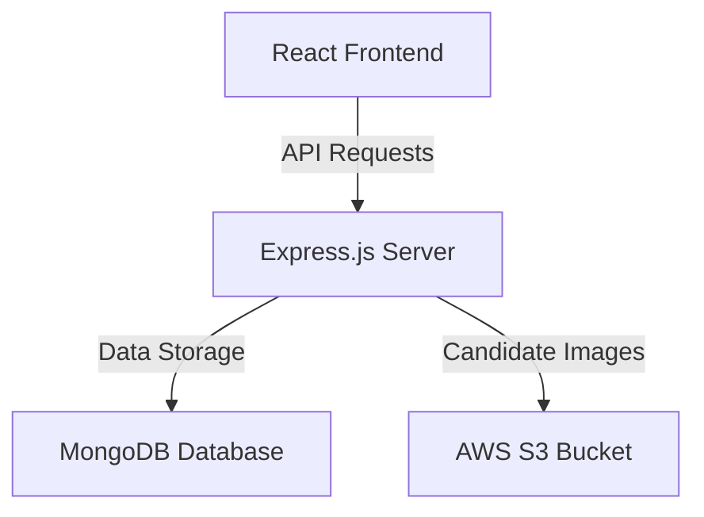

# Academically Placement Management System (MERN & S3 Upgrade)

This repository hosts the Academically site brochure and dynamic placements management application. The project is built using React (Vite) on the frontend, with a Node/Express backend powered by MongoDB and AWS S3 image storage.

---

## Architecture Overview



- **Frontend (Root):** React (Vite), Tailwind CSS v4, dynamic API loading with loading skeletons, and static JSON data fallback.
- **Backend (`/backend`):** Node, Express, MongoDB (Mongoose), AWS S3 integration via AWS SDK JS v3, cookie-based JWT authentication, rate limiting, and Helmet security headers.

---

## Local Development Setup

### 1. Database Setup
Ensure that you have MongoDB running locally on your machine.
- Local Connection URI: `mongodb://127.0.0.1:27017/placement_management`

### 2. Backend Installation & Setup
1. Navigate to the `backend/` folder:
   ```bash
   cd backend
   ```
2. Install dependencies:
   ```bash
   npm install
   ```
3. Set up your environment variables by copying `.env.example` to `.env`:
   ```bash
   cp .env.example .env
   ```
   Modify the `.env` file with your details. For offline development, keeping `AWS_ACCESS_KEY_ID=mock_aws_access_key` will safely mock S3 uploads so the system works without AWS credentials.

4. Start the backend developer server:
   ```bash
   npm run dev
   ```
   The backend API will run on `http://localhost:5000`.

### 3. Frontend Installation & Setup
1. From the project root, install dependencies:
   ```bash
   npm install
   ```
2. Configure your environment variables in `.env` inside the root folder:
   ```env
   VITE_API_URL=http://localhost:5000
   ```
3. Start the Vite React development server:
   ```bash
   npm run dev
   ```
   The frontend will run on `http://localhost:5173`.

---

## Administration & Seeding Scripts

All administrative commands should be executed from the `backend/` directory:

### 1. Seeding the First Administrator
Execute the secure CLI prompt seeder:
```bash
npm run create:admin
```
Follow the interactive prompts to configure:
- **Name**
- **Email** (Unique, lowercase validated)
- **Password** (Min 6 chars, hashed via bcrypt)
- **Role** (`admin` or `super-admin`)

### 2. Running Data Migration
To safely migrate the 23 original hardcoded placements and local headshots into S3 & MongoDB:

- **Dry-run Mode (Recommended first):**
  ```bash
  npm run migrate:placements:dry
  ```
- **Live Migration Run:**
  ```bash
  npm run migrate:placements
  ```
*Note: Running migration multiple times is safe. The script automatically checks slugs and candidate names to avoid duplicate insertions.*

---

## Production Configurations

### AWS S3 & IAM Settings
Ensure your S3 Bucket is configured with appropriate credentials:
1. **Required Permissions:**
   ```json
   {
       "Version": "2012-10-17",
       "Statement": [
           {
               "Sid": "AllowPlacementImageUploads",
               "Effect": "Allow",
               "Action": [
                   "s3:PutObject",
                   "s3:DeleteObject"
               ],
               "Resource": "arn:aws:s3:::YOUR_BUCKET_NAME/placements/*"
           }
       ]
   }
   ```
2. **S3 CORS Configuration (for direct image rendering/preview issues if any):**
   ```json
   [
     {
       "AllowedHeaders": ["*"],
       "AllowedMethods": ["GET", "HEAD"],
       "AllowedOrigins": ["https://brochure.academically.com"],
       "ExposeHeaders": []
     }
   ]
   ```

### Backend Production Environment Variables
Set the following environment variables in your production server environment:
- `PORT` (e.g. `5000`)
- `NODE_ENV=production`
- `MONGODB_URI` (Production MongoDB cluster link)
- `JWT_SECRET` (A strong unique passphrase)
- `FRONTEND_URL=https://brochure.academically.com`
- `COOKIE_DOMAIN=academically.com` (Ensures secure HTTP-only cookies are shared)
- `AWS_REGION` (e.g. `us-east-1`)
- `AWS_ACCESS_KEY_ID` (Your S3 IAM access key)
- `AWS_SECRET_ACCESS_KEY` (Your S3 IAM secret key)
- `AWS_S3_BUCKET` (Name of your S3 bucket)
- `AWS_PUBLIC_BASE_URL` (URL path of your S3 Bucket, e.g. `https://your-bucket.s3.amazonaws.com` or CloudFront URL)

---

## Rollback & Fallback Procedures

1. **Database Fallback:** The frontend public Placements page is engineered with a dynamic error safety net. If the Express API is down or the database returns zero placements, the page will automatically render the 23 hardcoded original placements.
2. **Image Recovery:** Original placement images in `public/Assets/` are never deleted by the migration scripts or application code, ensuring they can be recovered instantly.
3. **Database Backups:** Run the following command periodically on your MongoDB server to back up the database:
   ```bash
   mongodump --uri="YOUR_MONGODB_URI" --db=placement_management --out=/path/to/backup/dir
   ```
